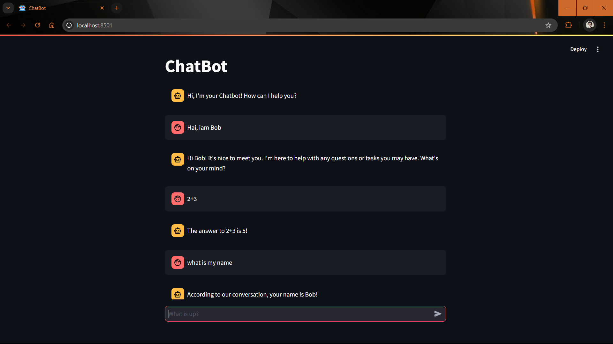

# ChatBot with LangChain and LLM
This chatbot application is built using LangChain, Groq API, and Streamlit. The chatbot can handle chat sessions with persistent message histories, and responses are generated using the llama3-8b-8192 model via Groq.




## Features
Uses LangChain for chat history and prompt management.
Integrated with Groq's llama3-8b-8192 model.
Persistent session handling using in-memory chat history.
Streamlit-based UI for user interaction.
## Architecture Overview
### 1. Environment Setup (llm.py)
* dotenv: Loads environment variables from .env to manage API keys.
* Groq API: Retrieves the GROQ_API_KEY from the environment and initializes the ChatGroq model with the selected model (llama3-8b-8192).
### 2. Chat Management (chat.py)
* Session Management: Chat sessions are uniquely identified using a session ID (generated with UUID). Each session stores its message history in-memory (InMemoryChatMessageHistory).
* Prompt Template: A prompt is defined for the chatbot that includes a system message and user messages. The system message defines the chatbot as a helpful assistant.
* Message Trimming: To prevent overflow, a trimming strategy is applied to keep message histories within a token limit.
* Runnable Chain: The core chatbot logic is handled by a chain that passes user input through the prompt and history, then invokes the Groq model to generate responses.
### 3. Streamlit User Interface (bot.py)
* Streamlit UI: Provides a simple web interface with a chat input box and message display. The session state holds the conversation history.
* User Interaction: When the user submits a message, it's displayed in the chat and passed to the model for generating a response.
* Response Handling: The chatbot responds after processing the input through the LangChain model, which is displayed in the chat UI.
### 4. Utilities (utils.py)
* Message Writing: Handles writing user and assistant messages to both the session state and the Streamlit UI.
* Session ID Management: Ensures each chat session has a unique identifier, which is stored in Streamlit’s session state.

## How to Run

### 1. **Prerequisites**
   - Python 3.x
   - Install dependencies:
     ```bash
     pip install -r requirements.txt
     ```

### 2. **Set Up Environment Variables**
   - Create a `.env` file in the root directory and add your Groq API key:
     ```bash
     GROQ_API_KEY=your_groq_api_key
     ```

### 3. **Run the ChatBot**
   - Launch the Streamlit app with the following command:
     ```bash
     streamlit run bot.py
     ```

### 4. **Usage**
   - Interact with the chatbot by typing in the chat input and pressing enter. The chatbot will respond based on the conversation history and the context provided.

## Project Structure

```bash
├── llm.py               # Handles model initialization and environment variables
├── chat.py              # Manages chat sessions and model interaction
├── bot.py               # Streamlit UI for the chatbot
├── utils.py             # Utility functions for message handling and session management
├── .env                 # Environment file for storing API keys
└── requirements.txt     # Python dependencies
